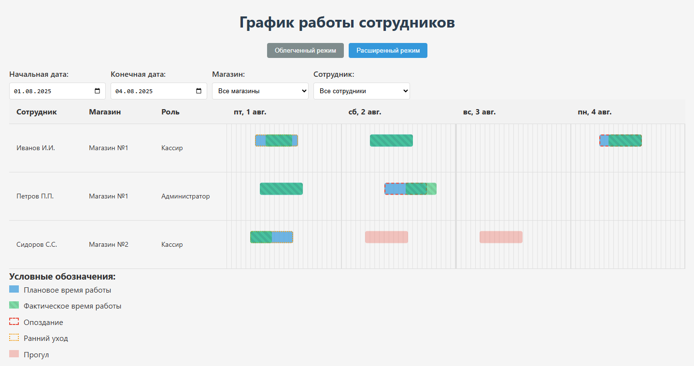
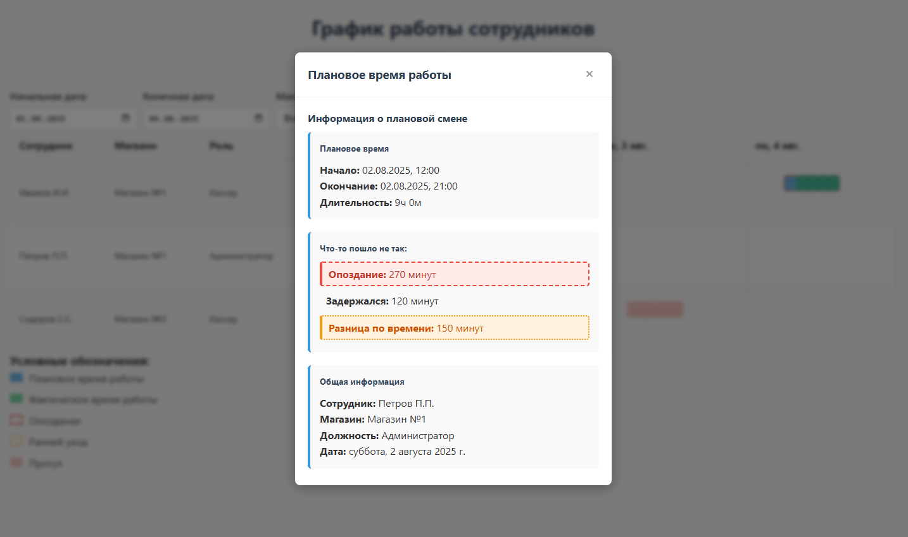

# 📊 График работы сотрудников

Красивое и интерактивное веб-приложение для визуализации планового и фактического рабочего времени сотрудников.

---

## 📖 Оглавление

- [О проекте](#-о-проекте)
- [Демо](#-демо)
- [Функциональность](#-функциональность)
- [Технологии](#-технологии)
- [Установка и запуск](#-установка-и-запуск)
- [Структура данных](#-структура-данных)
- [Разработчики](#-разработчики)
- [Лицензия](#-лицензия)

---

## 🧐 О проекте

Этот проект решает задачу анализа рабочего времени персонала. На основе двух наборов данных (План и Факт) строится наглядный временной график (Гант-чарт), который позволяет:
- Сравнивать плановое и фактическое время работы.
- Быстро выявлять опоздания, ранние уходы и прогулы.
- Видеть работу сотрудников across different stores and roles.

---

## 🎬 Демо

### Общий вид графика
Ниже представлен скриншот основного интерфейса приложения.

### Интерактивность и детализация
При нажатии на смену всплывает окно с детальной информацией.

### Анимация работы фильтров
На этой GIF демонстрируется, как пользователь может фильтровать данные по дате и магазину.

---

## ⚙️ Функциональность

- **📅 Визуализация графика:** Плановые смены отображаются сплошными прямоугольниками, фактические — с штриховкой.
- **👥 Группировка по сотрудникам:** Все смены одного сотрудника в выбранном периоде отображаются в одной строке, даже если их несколько.
- **🔍 Интерактивные элементы:** Клик по любой смене (план или факт) показывает всплывающее окно с деталями (сотрудник, магазин, роль, точное время).
- **⚠️ Визуализация несоответствий:** Система автоматически подсвечивает:
  - **Прогулы** (когда есть план, но нет факта)
  - **Опоздания** (фактическое начало позже планового)
  - **Ранние уходы** (фактическое окончание раньше планового)
- **⏳ Гибкие фильтры:** Фильтрация по периоду любой длительности, по магазинам и сотрудникам.

---

## 🛠 Технологии

- **Frontend:** TypeScript, React
- **Стилизация:** CSS
- **Сборка:** Webpack

---
